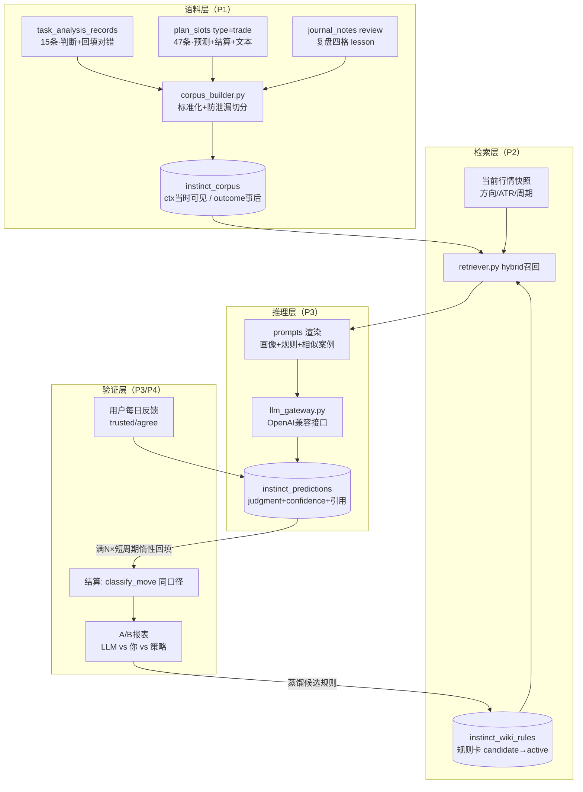

# RAG + LLM Wiki 模拟盘感落地方案

> 版本 v1.6 ｜ 2026-09-17（**U1 已解除：DeepSeek key 配置完毕，真实网关回灌 15/15 全验通过（D5 达成）**；P1~P3 全部机械部分 + /instinct 页面 + 闭环骨架 + /instinct/wiki 管理台交付；待宝塔重启 app 后任务自动注册，见 §4）
> 操作视角（怎么用）见姊妹文档：`doc/RAG_LLM_Wiki模块使用手册.md`
> 数据依据：`data/instinct_corpus_report.md`（P0 探针 `data/_probe_instinct_corpus.py` 实测产出）
> 建表 SQL：`doc/instinct_schema.sql`
> 计分口径：全程复用 `crypto/analysis_record_repo.py` 的 `classify_move / compute_stats`，不另起炉灶

---

## 0. 先说探针揭示的三个事实（方案由此定形）

P0 体检（生产库 hunter@49.51.136.88/crypto，2026-09-17 实测）：

| 事实 | 数字 | 对方案的影响 |
|---|---|---|
| **① 你的判断目前跑输策略** | 个人判断远窗口命中 **33.3% (5/15)** vs 策略方向 **53.3% (8/15)**；近窗口 20.0% vs 26.7% | 盘感模拟的第一价值不是"放大你的感觉"，而是**元认知**：告诉你"当前这种局面，你的历史命中率只有 X%，策略是 Y%"。系统定位=判感校准器，不是判感复读机 |
| **② 情景记忆太薄** | 带判断+已回填的分析记录仅 **15 条**（9/12~9/14），单币种最多 3 条 | 检索必须**跨币种共享特征空间**（同方向组合+同 ATR 分位泛化），不能按币种隔离；P3 影子预测要等语料累积，不能立即上线 |
| **③ 语义记忆为零** | 复盘条目 **0 条**、lesson 有效 **0 条**；但交易卡已结算预测有 **47 条**（含 30 条行情分析文本） | Wiki 层冷启动只能"人工种子规则 + 交易卡语料"起步；`journal_notes` 复盘四格要开始写，这是 lesson 的唯一来源 |

辅助发现：交易卡"有分析支撑"命中率 100% 但样本仅 2 条（无统计意义，仅记录现象）；分析记录文本原因覆盖率 66.7%（10/15）；ATR% 分布 p10=0.36 / p50=0.48 / p90=0.69，窄带分布，分位特征在近期波动环境下区分度有限——需要引入更长历史来定分位基准。

---

## 1. 系统架构框架

### 1.1 总体数据流



### 1.2 三层记忆模型

| 层 | 表 | 内容 | 压缩率 | 进 prompt 的部分 |
|---|---|---|---|---|
| **情景记忆**（episodic） | `instinct_corpus` | 每次决策的"当时可见上下文 + 判断 + 事后对错" | 1:1 | 仅 `ctx_*` 列 + 事后标签（作为该案例的"结果注记"） |
| **语义记忆**（semantic） | `instinct_wiki_rules` | 从 lesson + 混淆矩阵蒸馏出的显式规则卡 | N:1 | `status='active'` 且 condition 匹配当前快照的全部规则 |
| **工作记忆**（working） | `instinct_predictions` | 每次推理的输入快照、引用、输出、结算 | 审计流水 | 不进 prompt，供 A/B 与逐案复盘 |

**核心防泄漏不变式**：`ctx_*` 与 `outcome_*` 严格二分。检索、prompt、相似度计算只允许触碰 `ctx_*`；`outcome_*`/`hit_*` 只在结算任务和统计聚合里出现。任何新代码违反此约定视为缺陷（冒烟测试会断言这一点，见 §2 D8）。

### 1.3 RAG 检索对齐：为什么是 hybrid 而不是纯向量

"行情相似"的主体是**数值+类别上下文**（长短周期方向组合、ATR 分位、方向是否刚翻转、周期一致性），中文自由文本 `user_reason` 只是辅助。纯 embedding 检索会让"我觉得要涨"和"我觉得要跌"因为句式相近被召回为"相似"——完全反向。所以：

```
score(case, now) =
    3.0 × dir_pattern_sim      # 方向组合精确匹配：(short_dir, long_dir, flipped) 三级递减打分
  + 2.0 × atr_proximity        # 1 - |pctile_a - pctile_b|（分位数空间，跨币种可比）
  + 1.0 × period_match         # 短周期一致=1，同数量级=0.5
  + 1.5 × time_decay           # exp(-Δdays/τ)，τ=45天（策略已改版的老数据自动降权）
  + 2.0 × text_cosine          # v2 启用；v1 恒为 0
  × 3.0 if same_inst           # 同币种加成（但不足 topK 时允许跨币种补位）
```

v1 全部在 Python 内存计算（语料 < 5k 条时 MySQL 全量拉取一次 < 100ms），不引入 faiss；语料过万或加了向量路再切 `data/instinct/` 本地 faiss 索引。**注意项目有 memory_watchdog 800MB 强杀线，任何 embedding 方案不走本地模型，一律调 API。**

参考实现骨架（`crypto/instinct/retriever.py`）：

```python
def dir_pattern_sim(a: dict, b: dict) -> float:
    """方向组合相似度：全对1.0 / 长短对0.6 / 仅长对0.3 / 全错0"""
    if a['ctx_short_dir'] == b['ctx_short_dir'] and a['ctx_long_dir'] == b['ctx_long_dir']:
        return 1.0
    if a['ctx_long_dir'] == b['ctx_long_dir']:
        return 0.6 if a['ctx_dir_flipped'] == b['ctx_dir_flipped'] else 0.45
    return 0.3 if a['ctx_long_dir'] == b['ctx_long_dir'] else 0.0

def retrieve(now_ctx: dict, top_k: int = 6, days_back: int = 120,
             exclude_self_ref: str = '') -> list[dict]:
    """SQL 粗筛（时间窗+labeled）→ Python 精排。结果附带事后标签供展示，
    但标签字段命名为 outcome_*，prompt 渲染器只读 ctx_*（有单测断言）。"""
    with session_scope() as s:
        rows = s.execute(text(SQL_CORPUS_WINDOW), {'since': _since(days_back)}).mappings().all()
    scored = [(case_score(now_ctx, r), r) for r in rows if r['source_ref'] != exclude_self_ref]
    scored.sort(key=lambda x: -x[0])
    return [dict(r, score=round(sc, 4)) for sc, r in scored[:top_k]]
```

### 1.4 LLM 生成决策建议：Prompt 结构

四段式，总预算 ≤ 2.5k tokens（语料小时够便宜，语料大后靠 Wiki 层压缩）：

```
┌ SYSTEM (prompts/system_persona.md)
│  你是交易员本人的盘感模拟器。他的历史画像：<自动注入 compute_stats 口径的
│  命中率、混淆矩阵强弱势局面>。规则：只依据"当时可见信息"推理；输出严格 JSON；
│  必须引用案例/规则编号；无充分依据时 judgment=watch、confidence≤0.4。
├ WIKI 段：当前 condition 匹配的 active 规则卡（含统计依据 n 值）
├ CASES 段：topK 相似历史案例（ctx 字段 + 当时的 judgment/原话）
│   ⚠ v1 裁决（实现于 prompts.py，比原稿更保守）：不注入事后 actual/hit
│   注记——邻居标签在检索统计门证明判别力（当前 n=15 无判别力）之前，
│   只会诱导模型复读多数类标签，属有害噪声
└ NOW 段：当前行情快照（与案例同构的 ctx_* 字段，不含任何未来信息）
```

输出 JSON（`llm_gateway.py` 做 schema 校验，失败重试 1 次后记 `status='error'`）：

```json
{
  "judgment": "rise | watch | fall",
  "confidence": 0.0,
  "rationale": "≤120字，说明主导因素",
  "cited_rule_ids": [3, 7],
  "cited_corpus_ids": [12, 45],
  "meta_cognition": "该局面本人历史命中率低于策略，建议以规则为准"
}
```

`meta_cognition` 字段是针对 §0 事实① 的定制：当"你历史上这种局面弱于策略"时强制输出，让系统扮演校准器。

### 1.5 知识库（Wiki）构建方式

三条产出路径，全部先落 `candidate`，**用户在页面上一键确认才升 `active`**（防 LLM 幻觉规则污染盘感库）：

1. **lesson 蒸馏**：`journal_notes(type=review)` 的 `review_lesson` 非空且未 `distilled` → LLM 转写为"条件+结论+证据引用"规则卡 → 回写 `distilled=1`。
2. **统计蒸馏**（定时任务，无需 LLM）：按 `混淆矩阵格子 × 方向组合 × ATR分位段` 聚合语料命中率，任一桶 n≥10 且 |命中率 − 全局命中率| ≥ 15pp → 生成 `scenario/prohibition` 规则（例："long_dir 刚翻转时你的远窗口命中 20% vs 全局 33% → 该局面降权"）。
3. **人工录入**：你在页面直接写规则（`created_by='user'`，直接 active）。

合并与过期：新证据更新同 `rule_key` 旧卡并记 `supersedes_id`（沿用学习任务卡顺延合并的做法，不插重复卡）；每卡带 `valid_until`（默认 90 天），到期自动降回 candidate 等复核——盘感规则会失效，这是显式设计。

### 1.6 新增文件与模块规划

```
crypto/instinct/                    # 新包，风格对齐现有 *_repo/_routes 分层
├── __init__.py
├── corpus_builder.py               # 三源 → instinct_corpus，幂等（uk source+source_ref）
├── retriever.py                    # hybrid 检索 + 打分（§1.3）
├── wiki_repo.py                    # 规则卡 CRUD / candidate→active / 合并
├── wiki_distiller.py               # 蒸馏任务：lesson 路 + 统计路
├── llm_gateway.py                  # OpenAI 兼容客户端（httpx，显式超时）+ JSON 校验
├── predict_service.py              # 组 prompt→调 LLM→写 instinct_predictions→惰性结算
├── instinct_routes.py              # Blueprint '/instinct'，接 web_auth 口令闸门
├── prompts/
│   ├── system_persona.md
│   ├── decision_prompt.md          # 模板占位：{{wiki}} {{cases}} {{now}} {{profile}}
│   └── distill_prompt.md
└── templates/instinct.html         # 盘感页：影子预测流 / 规则卡管理 / A/B 报表
crypto/app.py                       # +1 行 register_blueprint(instinct_bp)
db_schema.sql                       # P1 时并入 doc/instinct_schema.sql 的 4 张表
data/instinct/                      # （预留）faiss 索引、报告输出，走 CRYPTO_PLAN_DATA_DIR
```

配置（对齐现有 `CRYPTO_DB_URL` 外置风格，新增三个环境变量，**密钥不落库不入库**）：

```
CRYPTO_LLM_BASE_URL   # OpenAI 兼容 endpoint
CRYPTO_LLM_API_KEY    # 密钥（宝塔环境变量面板配置）
CRYPTO_LLM_MODEL      # 决策模型名；embedding 模型名单独 CRYPTO_EMBED_MODEL（v2）
```

---

## 2. 助手需完成的工作清单（交付物）

| # | 交付物 | 路径 | 内容 | 验收标准 |
|---|---|---|---|---|
| D0 | **数据库探针脚本** ✅本批已交付 | `data/_probe_instinct_corpus.py` + 报告 `data/instinct_corpus_report.md` | 四源体量、命中率基线、ATR 分布、门槛判定 | 已在生产库跑通，只读，退出码 0 |
| D1 | 建表 SQL + 生产建表 ✅已完成 | `doc/instinct_schema.sql`（执行器 `data/_apply_instinct_schema.py`）；4 表已并入 `db_schema.sql`(批次12) 与 `crypto/models.py`(ORM)，并已登记 `database._NEW_TABLE_NAMES` 自动补建 | 生产库 4 表已建成（checkfirst，0 破坏性） |
| D2 | 语料管道 ✅已完成 | `crypto/instinct/corpus_builder.py`：三源抽取→标准化→防泄漏切分→幂等 upsert；CLI `--dry-run/--apply/--verify` | 实跑：65 样本入库（analysis_record=15 + trade_slot=50，含 3 条未结算 labeled=0；journal_review=0 待 U2）；重跑 0 新增 0 更新；`--verify` 四项基线与 P0 冻结值逐位一致 ✅ |
| D3 | 检索对齐 ✅已完成 | `crypto/instinct/retriever.py` | §1.3 打分函数 + leave-one-out 自检 CLI | 实跑：结构门（topK 非空+确定性）✅；**统计门因样本不足如实搁置**（analysis_record labeled 15 < 30，且首轮全池自检实测到 trade_slot 无 ctx 样本污染多数投票，已改为同源池；n≥30 后复跑，见 §4-P2 记录） |
| D4 | Wiki 仓库+蒸馏 ✅统计+种子路完成 | `crypto/instinct/wiki_repo.py`（状态机/条件 DSL/过期降级/rule_key 幂等合并）、`crypto/instinct/wiki_distiller.py`（分桶统计路+个人vs策略种子元规则路+报告 `data/instinct_wiki_report.md`）；lesson 路仍依赖 U2（数据 0 条） | 实跑：同 `rule_key` 二次蒸馏 merged 不重复建卡 ✅；首批显著候选=1 条 `seed:user-vs-strategy-far`（meta，candidate 待确认）；stat 桶 0 条过门槛（各局面桶 n<10，预期内，宁缺毋滥） |
| D5 | LLM 网关+提示词 ✅**真实网关全验通过**（2026-09-17 U1 到位） | `crypto/instinct/llm_gateway.py`（httpx 超时 30s/重试 1 次/schema 硬校验/未配置显式抛错不假成功；mock 网关与真实网关共用校验出口，`model='mock'` 可隔离）、`crypto/instinct/prompts.py`（四段式渲染 + fail-closed 泄漏拦截） | mock 回灌 15/15 ✅；**DeepSeek 真实回灌 15/15 成功 0 失败、泄漏拦截 0、引用真实性 100%**（首验 15/15 全挂暴露真机行为差异：模型把 `[C1]` 标签原样填进 cited 数组，parse 层已归一化 `C1/R2/"3"`→整数并补冒烟断言，越界兜底不变）。单发延迟 ~2.6s；网络瞬断（SSL EOF）由重试 1 次兜底 |
| D6 | HTTP API + 页面 ✅已完成 | `crypto/instinct_routes.py`（蓝图挂 `/instinct` 前缀，app.py 注册）、`templates/instinct.html`、nav「🧠 盘感模拟」入口 | `/api/now?instId=`（同源快照+topK+命中规则）、`/api/predict`、`/api/rules`(GET/confirm/retire)、`/api/settle`、`/api/predictions`+`feedback`、`/api/stats`；鉴权由全局 web_auth 闸门覆盖 | 实测：无 key 时 predict 返回明确 503 指引不假成功；配口令后未带凭证 401 ✅；页面五区块（局面/案例/规则/流水/三感对比）可用 ✅ |
| D7 | 影子预测+结算任务 ✅骨架完成（U1 已到位：key 配好重启 app 即自动注册） | `crypto/instinct/predict_service.py`：`--backfill` 历史回灌 + `predict_now`（build_live_ctx 同源快照→管线→pending 行）+ `settle_pending`（复用 review_windows_for/_review_price_at/classify_move 满窗惰性结算）+ `run_instinct_hourly`（串行整点批）+ `register_instinct_jobs`（挂 task_scheduler；无 key 或 CRYPTO_INSTINCT_AUTO=0 不注册） | 回灌 persist 抽样核对：15 行 status=scored、hit 与语料 outcome 重算一致 ✅（验证行已清理）；结算口径与 task_analysis_records 复盘完全同源；批量串行规避 DualPeriodStrategyAdapter 全局状态竞争 |
| D8 | 冒烟测试 ✅P1~P3+D6/D7/D10 全绿 | `crypto/_smoke_instinct.py`（106 场景全绿，已登记 `SMOKE_TESTS.md`）：幂等/口径一致/防泄漏结构断言/verify 基线/检索打分与泄漏闸门/Wiki 状态机与条件匹配/蒸馏门槛复算/prompt 渲染泄漏负例/网关 schema 拒绝（含 C/R 前缀归一化正例 + 野标签/bool 负例）/引用真实性/回灌管线零失败/HTTP API 全端点与 401 闸门/Wiki 管理台（breakdown final==score、LOO 不含自身、蒸馏干跑不写库、trend 事件流） | 全绿；防泄漏断言含"负例"：故意往 prompt 渲染器塞 outcome 字段必须抛错；有 key 时自动改走"任务注册成功"分支断言 |
| D9 | A/B 报表 ✅后端+页面完成 | `/instinct/api/stats` + 页面「三感对比」区块 | LLM/你/策略三列近远窗口命中率、pending 数、mock 一律排除；trusted/agree 反馈经 `/api/predictions/<id>/feedback` 落库 | 实测：LLM scored < 60 时返回 `insufficient=true` 并显式标注"样本不足，仅供参考"，不给结论性文案 ✅ |
| D10 | 盘感 Wiki 管理台 ✅完成 | `templates/instinct_wiki.html`（四标签页：规则卡治理/预测审计/校准仪表盘/检索测试）+ `static/css/instinct_wiki.css`（iwk- 前缀全隔离）+ `instinct_routes.py` 扩 4 端点（`/wiki` 页、`/api/search_test`、`/api/trend`、`/api/distill`、`/api/expire`，蓝图共 16 端点）+ `retriever.explain()`（非侵入打分明细，不改生产检索路径） | 蒸馏按钮 apply=true 也只落 candidate（激活仍须逐条人工确认，铁律不变）；检索测试三模式（manual/corpus-LOO/live）展示 dir/atr/period/decay 加权分解，`final==score` 与生产总分逐位一致（冒烟断言锁定）；趋势图为逐条 0/1 事件流前端累计（不平滑不藏样本）；outcome 注记仅人工核对，prompt 通道物理隔离 | 实测：四标签全通、104 场景冒烟全绿、`node --check` 两页面 JS 通过 ✅ |

顺序依赖：D1→D2→D3→(D4 统计路)→D5→D7→D6→D8→D9；D10（Wiki 管理台）依赖 D6/D9；D4 lesson 路依赖用户开始写复盘（§3）。

---

## 3. 用户需提供的内容清单

| # | 类别 | 具体事项 | 交付形式 | 卡哪个阶段 |
|---|---|---|---|---|
| U1 | **LLM 接入** ✅**已达成（2026-09-17）** | DeepSeek key 已写入 `crypto/api_config.py`（gitignored）`CRYPTO_LLM_BASE_URL/API_KEY/MODEL` 三常量；真实网关回灌 15/15 验证通过 | ~~宝塔面板环境变量或告知我写进 api_config.py~~ 已完成 | ~~P3（D5/D7）~~ 解除 |
| U2 | **复盘习惯启动** | 每天在随笔页用"复盘"类型写四格（对象/决策/结果/教训）≥1 条——当前 lesson 有效 0 条，Wiki 的 lesson 蒸馏路完全断供 | 功能已有，只需开始使用；存量 15 条随笔中如有所感也可补标 lesson | P2+（D4 lesson 路） |
| U3 | **分析记录积累** | 按现有分析纪律继续每小时槽打卡记录（当前 15 条、日均 ~7 条）。P3 影子预测上线门槛：**labeled 样本 ≥ 100**，按当前节奏约 2 周后达成 | 正常使用即可；也可授权我从交易卡 47 条已结算预测提前扩充语料（需你确认其 `market_analysis` 是"当时写的"而非事后补的） | P3 启动时点 |
| U4 | **规则审核** | 每周在 `/instinct` 页面把 candidate 规则卡过一遍（确认/驳回），10 分钟内 | 页面操作 | Wiki active 层质量 |
| U5 | **参数偏好确认** | ① topK=6、时间衰减 τ=45 天 ② 统计蒸馏门槛 n≥10 / 偏离 15pp ③ confidence 三档：≥0.65 可参考、0.4~0.65 仅提示、<0.4 强制 watch ④ 中性带 θ 沿用 `HIT_ATR_K=0.3` 不改。有异议现在提，默认按此实现 | 回复确认即可 | P1 实现细节 |
| U6 | **验证反馈** | 影子预测期内，每天对预测点两个按钮："当时会信吗"(trusted)、"和你一致吗"(agree)——这是 §0 事实① 元认知校准是否有效的唯一裁判 | 页面逐条标记，日均 1 分钟 | P4 验收 |
| U7 | **噪声划定** | 告知哪些历史数据属于"策略改版前/心态失衡期"应从语料剔除（可给时间段），系统按 `ctx_dir_flipped`+时间衰减只是软降权 | 回复一段日期范围 | P1（可选） |

---

## 4. 实施步骤与验收标准（分阶段）

### P0 数据体检（已完成，本次交付）

- 步骤：探针脚本 → 生产库只读体检 → 报告落盘。
- ✅ 验收：报告产出、四项基线（20.0%/33.3%/26.7%/53.3%）作为后续所有阶段的对照组数字冻结。

### P1 语料入库 ✅已完成（2026-09-17）

1. ✅ 4 张表已在生产库建成（`data/_apply_instinct_schema.py`，checkfirst 零破坏），并同步并入 `db_schema.sql`（批次12）与 `crypto/models.py`（ORM，`init_db` 自动补建登记）；
2. ✅ `corpus_builder.py --dry-run` 样例核对通过（ctx/outcome 切分正确，journal_review 源当前 0 条属预期）；
3. ✅ 全量入库 65 样本（analysis_record=15、trade_slot=50）；幂等重跑 0 新增 0 更新；`--verify` 三方核对 PASS；冒烟 23/23 全绿并登记 SMOKE_TESTS.md。

**验收**：幂等重跑 0 重复 ✅；语料回算命中率与 P0 冻结基线逐位一致（20.0/33.3/26.7/53.3）✅；防泄漏结构断言通过 ✅。

### P2 检索 + Wiki 冷启动 ✅已完成（2026-09-17，验收口径有两处如实修正）

1. ✅ `retriever.py`（打分公式按 §1.3；`sources` 参数区分数值检索池）+ `--self-check` CLI；
2. ✅ `wiki_repo.py`（rule_key 幂等合并、candidate→active→retired 状态机、条件 DSL fail-closed、90 天过期自动降级）；
3. ✅ `wiki_distiller.py --report/--apply/--list`：分桶统计路 + "个人 vs 策略"种子元规则路，报告固定落盘 `data/instinct_wiki_report.md`；
4. ✅ 实跑：`seed:user-vs-strategy-far`（meta）已入库为 **candidate**；stat 桶 0 条过门槛（n<10 全被挡，原预期的"watch 过滥/翻转追单"两类当前数据不支持出卡——宁缺毋滥）。

**验收实况与口径修正（重要，勿当"已及格"读）**：
- 结构门 ✅：全部查询 topK 非空、排序确定、LOO 排除自身、sanitize/泄漏闸门负例通过；
- 统计门 ⏸ **未出判定**：首轮全池自检实测到 trade_slot（无 ctx、far 边际命中率 88.9%）污染多数投票——一致率与其边际率完全相等（75.8% vs 75.8%），属假信号；修正为 analysis_record 同源池 + "永远猜多数类"基线（66.7%+10pp），但 n=15 < 30 不出统计结论，**延后至语料 n≥30 复跑（P4 复检项）**。当前实测一致率 33.3%，即现有密度下"相似邻居"对远窗口命中尚无判别力，这正是需要积累语料验证的假设，而非已证明的失效；
- 原"active 规则 ≥ 2 条"未达成且**不自行达成**：种子改由数据复算自动生成（P0 事实①持续复算版，替代手写文案），状态机铁律要求 active 必须你确认——**2026-09-17 更新：你以"按你的建议，继续"授权后，第 1 条 `seed:user-vs-strategy-far` 已激活为 active（confirmed_by=user，可随时 `retire_rule(1)` 回退）**；active 现为 1 条，后续新候选仍逐条待你确认。

### P3 LLM 影子预测 ✅管线+闭环骨架完成（2026-09-17），真实调用依赖 U1

**已交付（无 key 可验证的机械全链路，冒烟组 9/10/11/12/13 覆盖）**：
1. ✅ `prompts.py` 四段式渲染：输入含 outcome 键 fail-closed 抛错；CASES 不注入命中注记（见 §1.4 裁决）；渲染产物过 `assert_no_future_leak`；
2. ✅ `llm_gateway.py`：env `CRYPTO_LLM_*` 三级读取、httpx 30s 超时、重试 1 次、schema 硬校验（judgment/confidence/rationale/cited 整数组）、未配置显式抛错绝不假成功；mock 网关（`model='mock'` 统计可隔离）走同一校验出口；
3. ✅ `predict_service.py --backfill`：LOO 锚定历史回灌 + "anchor 前已存在的 active 规则"过滤（防未来规则评历史题）+ 引用编号→真实 DB id 映射 + corpus 即时结算；mock 15/15 解析失败率 0%、persist 抽样 15 行 hit 重算一致后已清理；
4. ✅ D6 上线：`crypto/instinct_routes.py` 蓝图 + `templates/instinct.html` + nav 入口，12 个端点全实测（页面/币种/规则确认与否决/结算/流水反馈/三感对比）；无 key 时 predict 返回明确 503 指引；
5. ✅ D7 闭环骨架：`predict_now`（同源快照→管线→pending 落库）/ `settle_pending`（与 task_analysis_records 复盘同一套 `review_windows_for + _review_price_at + classify_move`，近远两窗齐才置 scored）/ `run_instinct_hourly`（串行整点批 + 过期降级，未配 key 直接 skip 不假成功）/ `register_instinct_jobs`（挂 task_scheduler，**无 key 或 CRYPTO_INSTINCT_AUTO=0 时不注册**，任务列表干净缺席）；
6. ✅ D10 Wiki 管理台：`/instinct/wiki` 四标签页（规则卡治理含蒸馏/过期按钮、预测审计全字段+反馈、校准仪表盘 trend 事件流、检索测试三模式），新增 `/api/search_test`、`/api/trend`、`/api/distill`、`/api/expire` 四端点（蓝图共 16 端点）；蒸馏入口沿用铁律——apply 也只落 candidate；
7. ✅ `retriever.explain()`：对 topK 结果用同一批纯函数复算子分项 breakdown（dir/atr/period/decay 原始分→加权分→base×boost=final），不改生产检索路径；`final==score` 逐位一致由冒烟断言锁定。

**剩余（拿到 U1 key 即做）**：~~① 真实网关对同 15 样本重跑（D5 全验）~~ ✅2026-09-17 完成：真实回灌 15/15 成功 0 失败（干跑未落库）；② 配置即上线——**key 已写入 `api_config.py`，宝塔侧重启 app 后**整点影子预测/结算任务自动注册，进入"连续 7 天无窗口报错"观察期。

> **2026-09-17 数据事故记录**：发现 `task_analysis_records` 15 条源记录被页面删除端点清空（代码内无自动删除路径，为外部/人为操作）。已用 `data/_rebuild_tar_from_corpus.py` 从 `instinct_corpus` 快照按原 id 反推重建（price_1h/4h 由 chg 反推，classify_move 重算与语料逐位一致后才写库；ts_1h/ts_4h/hour_slot 三个纯展示列不可恢复置空），`--verify` 三方核对恢复 20.0/33.3/26.7/53.3 全绿。若宝塔侧有 MySQL 备份可按 id 换回原行。教训：**语料层反向成为源数据的兜底快照**，也暴露删除端点无二次确认的风险（已列入告警观察）。

**验收**：JSON 解析失败率 < 5%；引用真实性 100%；结算数字与手工用 repo 函数抽样核对一致；连续 7 天无窗口报错（logs 无 instinct ERROR）。

### P4 A/B 验证与"上线"判定（P3 后 ~3 周，N≥60）

对比三列：LLM 盘感 vs 你本人 vs 策略方向，近/远窗口双口径 + 规则分桶明细。

**验收（全部满足才把模块从"影子"升为"实盘参考"级）**：
1. LLM 远窗口命中率 ≥ 你的 33.3% 基线，且 ≥ 策略 53.3% − 5pp；
2. trusted/agree 数据显示：元认知提示（你弱势局面）下你的实际判断改善，或你主动采纳率与后验命中率正相关；
3. 任一不满足 → 维持影子级继续积累，**永不接入交易执行链路**（该边界写死在架构里：instinct 包不 import 任何下单模块）。

### 回滚预案

模块自治：`instinct_*` 四张表独立、路由独立 Blueprint、任务可单独停。回滚 = app.py 摘除一行注册 + 停调度任务，数据保留不删。

---

## 附：已交付文件

| 文件 | 说明 |
|---|---|
| `data/_probe_instinct_corpus.py` | P0 探针（只读，可重跑），复用 `analysis_record_repo` 常量保证口径一致 |
| `data/instinct_corpus_report.md` | 生产库体检报告（本方案 §0 数字来源） |
| `doc/instinct_schema.sql` | 4 张新表建表 SQL（P1 已在生产库执行 ✅） |
| `data/_apply_instinct_schema.py` | P1 建表执行器（checkfirst，可重复跑） |
| `crypto/instinct/__init__.py` | 盘感模块包（含"不 import 交易模块"边界声明） |
| `crypto/instinct/corpus_builder.py` | P1 语料管道（三源标准化 + 幂等 upsert + verify） |
| `crypto/instinct/retriever.py` | P2 hybrid 检索 + leave-one-out 自检 + sanitize/泄漏闸门（`--self-check` / `--demo id`）+ `explain()` 打分明细（非侵入复算，final==score 一致性断言） |
| `crypto/instinct/wiki_repo.py` | P2 规则卡仓库：rule_key 幂等合并、状态机、条件 DSL、过期降级 |
| `crypto/instinct/wiki_distiller.py` | P2 统计蒸馏（无需 LLM）：分桶路 + 种子元规则路（`--report` / `--apply` / `--list`） |
| `data/instinct_wiki_report.md` | 蒸馏报告（混淆矩阵/分桶/候选，`--apply` 时同步刷新） |
| `crypto/instinct/prompts.py` | P3 四段式提示词渲染 + fail-closed 泄漏拦截（case hit 注记 v1 不注入） |
| `crypto/instinct/llm_gateway.py` | P3 OpenAI 兼容网关（超时/重试/schema 校验）+ 确定性 mock 网关（`model='mock'` 隔离） |
| `crypto/instinct/predict_service.py` | P3 影子预测：历史回灌（LOO 锚定 + 时点规则过滤 + 即时结算）+ 实时闭环（`build_live_ctx/predict_now/settle_pending/run_instinct_hourly/register_instinct_jobs`） |
| `crypto/instinct_routes.py` | D6/D9/D10 蓝图：/instinct + /instinct/wiki 页面 + 14 个 JSON 端点（只读行情、只写 instinct_* 表，鉴权走全局 web_auth 闸门） |
| `crypto/templates/instinct.html` / `instinct_wiki.html` / `nav.html` / `app.py` / `task/scheduler.py` | D6 页面五区块与导航入口；D10 Wiki 管理台四标签页；蓝图注册；影子预测任务挂载（无 key 不注册） |
| `crypto/static/css/instinct_wiki.css` | D10 专属样式（iwk- 前缀全隔离，不碰 style.css） |
| `crypto/_smoke_instinct.py` | P1~P3+D6/D7/D10 冒烟（104 场景，写库+快照还原隔离，已登记 SMOKE_TESTS.md） |
| `crypto/models.py` / `db_schema.sql` / `crypto/database.py` | 批次12 ORM 模型 + 权威建表 + 新表自动补建登记 |
| `doc/RAG_LLM_Wiki模拟盘感落地方案.md` | 本文档 |
| `doc/RAG_LLM_Wiki模块使用手册.md` | D10 操作手册：架构/数据流图、两页面操作指南、CLI 速查、CRYPTO_LLM_* 配置、治理流程、FAQ、回滚预案 |
| `data/_probe_llm_real.py` | U1 到位后的真实网关连通性探测（单发 schema 校验 + 延迟） |
| `data/_rebuild_tar_from_corpus.py` | 数据事故应急：从 instinct_corpus 反推重建被删的 task_analysis_records（干跑核对→口径零漂移才写库） |
